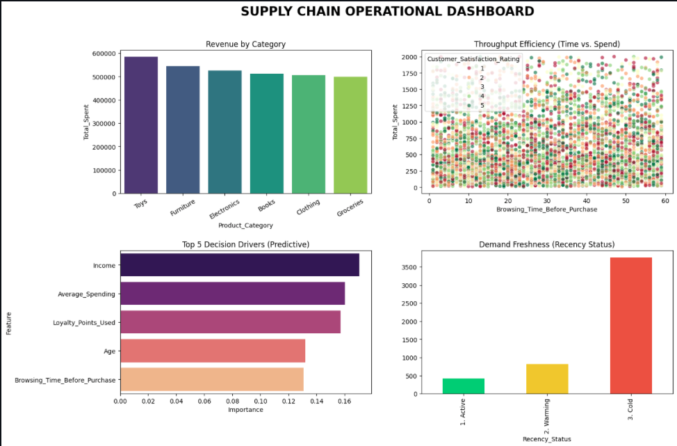

  

## Project Overview
This project provides a data-driven framework for optimizing supply chain operations. By analyzing customer purchase behavior, the system identifies core revenue drivers, evaluates operational efficiency, and utilizes machine learning to predict high-value logistics requirements.

## Core Framework
* **Data Integrity:** Establishing a "Single Source of Truth" by cleaning and standardizing behavioral datasets.
* **Demand Intelligence:** Applying Pareto Analysis (80/20 rule) to isolate the product categories driving the majority of revenue.
* **Operational Velocity:** Measuring "Revenue per Minute" (RPM) to identify peak throughput windows for logistics fulfillment.
* **Predictive Modeling:** Using a Random Forest Classifier to forecast high-value transactions, enabling predictive resource allocation.

## Technical Stack
* **Language:** Python 3.x
* **Libraries:** Pandas, Scikit-Learn, NumPy
* **Model Type:** Random Forest Classifier

## Strategic Inferences
1. **Revenue Concentration:** Identifies which product categories require 15% higher safety stock levels.
2. **Peak Efficiency:** Maps the specific shopping times that require maximum logistics bandwidth.
3. **Inventory Risk:** Quantifies "Cold Demand" (customers inactive for >90 days) to prevent capital stagnation.
4. **Value Drivers:** Isolates the primary customer traits that predict high-spend transactions.

## Execution Instructions
1. Ensure `Customer Purchase Behavior datasets.xlsx` is in the root directory.
2. Open the `analysis.ipynb` notebook in GitHub Codespaces.
3. Run the analysis script to generate the Operational Dashboard and the `supply_chain_action_plan.csv`.
